# 🍿 PopcornDB

**PopcornDB** is an analytics platform built with modern data infrastructure.
It demonstrates **real-time + batch processing, scalable microservices, and polyglot persistence**.

---

## 🧑🏻‍💻 Tech Stack

- **Apache Kafka** → Event streaming
- **Apache Flink** → Real-time processing (trending movies, rolling aggregates)
- **Apache Cassandra** → Serving layer (low-latency lookups)
- **Apache Iceberg** → Lakehouse storage (batch analytics, time-travel)
- **Apache Spark** → Batch ETL (IMDb → Iceberg)
- **Apache Airflow** → Orchestration & scheduling
- **DataJunction** → Semantic metrics layer
- **FastAPI** → Microservices (rating simulator, metadata API)

---

## 🏦 Architecture



```mermaid
flowchart TD
    subgraph Batch["Batch Ingestion"]
        IMDb[IMDb TSV Files] --> SparkETL[Spark ETL Service]
        SparkETL --> Iceberg[Iceberg Lakehouse]
        AirflowDAG[Airflow DAG] --> SparkETL
        AirflowDAG --> Iceberg
    end

    subgraph Streaming["Streaming Pipeline"]
        RatingSim[Rating Simulator] --> Kafka[Kafka Topics]
        Kafka --> Flink[Flink Streaming Job]
        Flink --> Cassandra[Cassandra Serving Layer]
        Flink --> Iceberg
        AirflowDAG --> Flink
    end

    subgraph APIs["Serving & Metrics"]
        Cassandra --> MetadataAPI[Metadata API Service]
        Iceberg --> DataJunction[DataJunction Metrics]
        DataJunction --> AnalyticsAPI[Analytics API Service]
    end

    subgraph AnalyticsDashboards["Dashboards & Analytics"]
        AnalyticsAPI --> Dashboard[Superset / Metabase]
    end

    %% Styling
    classDef batch fill:#000,stroke:#1f77b4,stroke-width:1px;
    classDef stream fill:#000,stroke:#ff7f0e,stroke-width:1px;
    classDef storage fill:#000,stroke:#2ca02c,stroke-width:1px;
    classDef api fill:#000,stroke:#9467bd,stroke-width:1px;
    classDef dashboard fill:#000,stroke:#d62728,stroke-width:1px;
    classDef apis fill:#000,stroke:#d62728,stroke-width:1px;

    class Batch batch;
    class Streaming stream;
    class Iceberg storage;
    class Cassandra storage;
    class MetadataAPI,AnalyticsAPI,DataJunction api;
    class Dashboard dashboard;
    class AnalyticsDashboards dashboard;
    class APIs api;

```

### Flow

1. **Batch Ingestion**

   - IMDb `.tsv` data files → Spark → Iceberg (bronze/silver/gold tables).
   - Orchestrated by Airflow.

2. **Streaming Events**

   - Rating Simulator → Kafka → Flink → Cassandra + Iceberg.

3. **Serving Layer**

   - Cassandra for low-latency queries (e.g. last 10 ratings per user).
   - Iceberg for deep analytics.

4. **Metrics & APIs**
   - DataJunction defines consistent metrics.
   - FastAPI serves metadata & analytics.

---

## ⚖️ Scalability Decisions

- **Cassandra**

  - Partitioned by `movie_id` / `user_id` → linearly scalable.
  - Replication factor ensures high availability.

- **Iceberg**

  - Partitioned by `event_date, movie_id` → fast queries.
  - Snapshots avoid costly rewrites at scale.

- **Kafka**

  - Partitioned topics → consumers scale horizontally.
  - Multiple brokers for fault-tolerance.

- **Flink**

  - Parallelism per job → real-time scaling.
  - Checkpointing for exactly-once guarantees.

- **Microservices + Containers**
  - Each service isolated in Docker.
  - Orchestrated by Docker Compose (local) or Kubernetes (scale-out demo).
  - APIs are stateless → can be scaled independently.

---

## 📦 Repository Strategy

This repo is a **monorepo** containing all PopcornDB services.

- ✅ Easy to clone/run.
- ✅ Shared configs and infra in one place.

In **production**, each microservice would likely live in its own repo with independent CI/CD pipelines (polyrepo model).  
I chose a **monorepo** here to balance realism with simplicity.

---

## 📂 Repo Layout

```
services/      → All microservices
infra/         → Docker Compose + Kubernetes manifests
docs/          → Architecture diagrams + scaling decisions
dashboards/    → BI configs (optional)
```

---

## 🛠 How to Run (Local Dev)

```bash
# Spin up full environment
docker-compose up --build

# Seed IMDb data into Iceberg
docker exec spark-etl spark-submit jobs/imdb_ingest.py

# Start rating simulator
docker exec rating-simulator python simulate_ratings.py
```

---

## 🌎 Roadmap

| Feature                                                | Status  |
| ------------------------------------------------------ | ------- |
| Batch ingestion pipeline (Spark → Iceberg)             | ✅ Done |
| Streaming pipeline (Kafka → Flink → Cassandra/Iceberg) | ✅ Done |
| FastAPI Metadata + Analytics APIs                      | ⬜ Todo |
| DataJunction semantic metrics                          | ⬜ Todo |
| Superset dashboards                                    | ⬜ Todo |
| Kubernetes manifests for scale-out demo                | ⬜ Todo |
